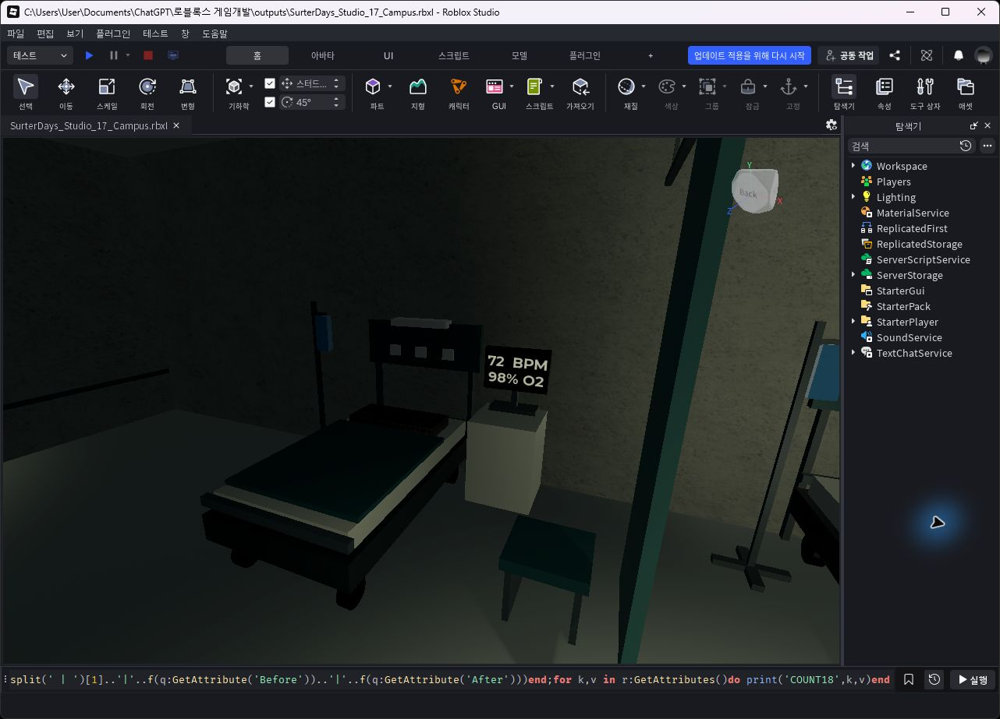
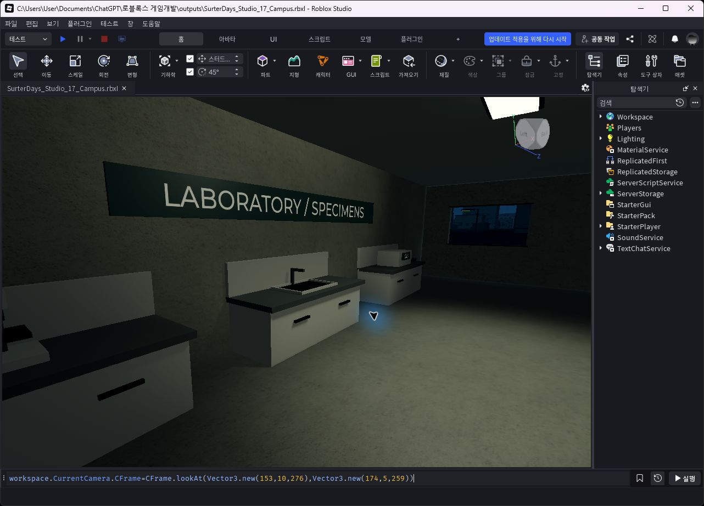

# Surter: Days

Roblox 좀비 생존·익스트랙션 게임의 도시 맵 작업본입니다.

## 맵 열기

1. 이 저장소를 다운로드하거나 복제합니다.
2. Roblox Studio에서 **파일 → 파일 열기**를 선택합니다.
3. [`outputs/SurterDays_Studio_18_HospitalFit.rbxl`](outputs/SurterDays_Studio_18_HospitalFit.rbxl)을 엽니다.
4. Play로 맵을 둘러볼 수 있습니다.

최신 업로드는 2026-09-15에 저장한 **18번 병원 가구 수정본**입니다. 2026-09-27에 저장소로 옮겼습니다. 완성된 게임이나 출시용 빌드는 아닙니다.

## 포함된 자료

- `outputs/SurterDays_Studio_18_HospitalFit.rbxl`: 도시 전체가 포함된 최신 Studio 맵.
- `outputs/studio_review_18/`: 병원 수정 전후 사진, 개별 항목 119건 점검표, 검사 결과.
- `work/`: 12~18번 작업에서 사용한 편집·검증용 Luau 스크립트.
- `SESSION.md`: 작업 이력과 재개에 필요한 기록. 과거 버전 파일과 사진 경로 일부는 로컬 이력이며 이 저장소에 포함하지 않았습니다.

**편집 스크립트는 이미 맵에 적용되어 있습니다. 일괄 재실행하거나 게임 자동 실행 스크립트로 넣지 마세요.** 일부는 상대 이동 방식이며, 이 폴더만으로 맵을 처음부터 재생성할 수는 없습니다. 맵을 열 때 별도로 스크립트를 실행할 필요는 없습니다.

## 최근 변경과 검증

병상 26곳과 협탁, 선반, 수납장, 작업대 및 안내판의 벽 접점을 수정했습니다. 독립형 병상 12곳은 유지했습니다.

2026-09-15 Studio 검사에서 벽 접점 111곳과 통로 검사 216개가 통과했고, 실제 Play 보행 82구간도 통과했습니다. GitHub 업로드 시에는 파일 무결성을 확인했으며 게임 테스트를 새로 실행하지 않았습니다. 도시 전체 품질과 저사양 성능 검증은 아직 필요합니다.

