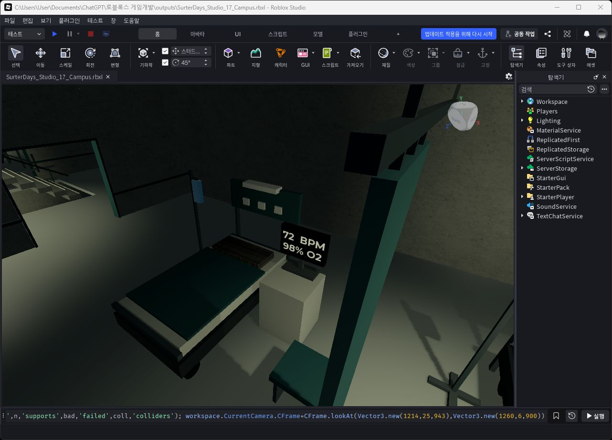
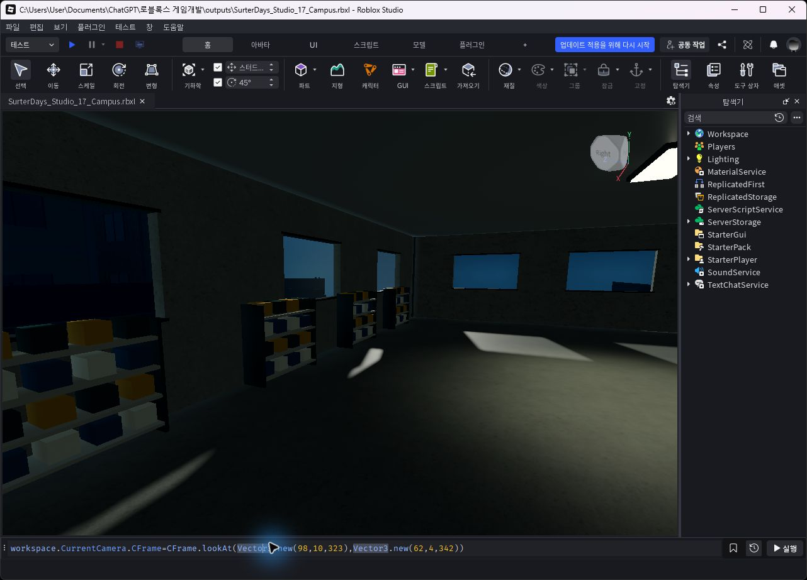
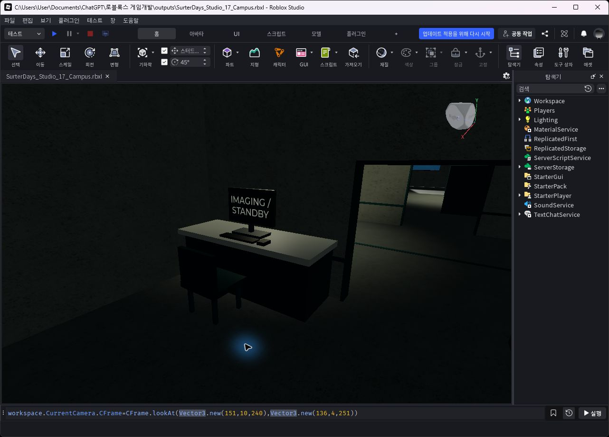

# 병원 가구 벽 접점 수정 — 18

저장: 2026-09-15 22:42 KST. `SurterDays_Studio_18_HospitalFit.rbxl` (3,295,018 bytes). 17번 원본 보존.

병상 38곳을 각각 검토해 26곳을 기존 벽 쪽으로 이동했습니다. 협탁 26개, 선반 13곳, 수납장 8개, 안내판 27개, 약국 작업대, 검사실 작업대 3곳, 영상검사실 조작대, 손 소독기와 배터리 소품도 보정했습니다. 병상에 연결된 모니터 받침·수액대·커튼·의자도 함께 이동했습니다. 이동한 부품은 1,390개이며 가구 개수와는 다릅니다.

앞쪽 열린 병동의 12개 병상은 뒤에 벽이 없어 독립형으로 유지했습니다. 벽 부착 대상은 뒷면을 벽에서 0.02 studs, 병상 머리판·협탁은 0.06 studs 떨어지게 맞췄습니다.

검증: 벽 접점 111곳 실패 0, 통로 검사 216개 실패 0. 침대 바퀴 152개, 기존 바닥 접점 각 44개 두 세트, 천장 장착 33개 검사 통과. 추가 수액대·협탁·선반·의자 지지부 174개도 실패 0. 실제 Play에서 기본 45구간과 병상 주변 37구간, 총 82구간 정상 보행 통과. 시작 위치만 시험용으로 이동했으며 구간 중 순간이동이나 점프를 사용하지 않았습니다.

이 기록은 병원 배치 수정 검증입니다. 도시 전체 아트 완성이나 저사양 성능 검증을 뜻하지 않습니다. 게임 로직·외부 에셋 추가·온라인 게시 없음.

## 사진

## 개별 점검 기록 119건

Studio 실제 개체 기록에서 추출했습니다. 좌표는 X,Y,Z (studs), 소수점 두 자리입니다. `BED_*_CAB`의 이전 좌표는 병상 전체 이동 이후, 협탁 추가 밀착 직전 좌표입니다. 개별 부품의 최초 좌표는 맵의 `CFrameBefore18` 속성에 보존했습니다. 병상 12개는 검토 후 유지 기록입니다.

| ID | 대상 | 작업 직전 좌표 | 작업 후 좌표 |
|---|---|---|---|
| BATTERY | Battery prop | 199.00,3.00,301.00 | 199.00,2.10,301.00 |
| BED_01 | Patient bay | 43.00,2.50,241.00 | 43.00,2.50,230.30 |
| BED_01_CAB | Bedside cabinet | 48.00,2.50,228.30 | 48.00,2.50,225.66 |
| BED_02 | Patient bay | 78.00,2.50,241.00 | 78.00,2.50,230.30 |
| BED_02_CAB | Bedside cabinet | 83.00,2.50,228.30 | 83.00,2.50,225.66 |
| BED_03 | Patient bay | 44.00,20.50,239.00 | 44.00,20.50,239.00 |
| BED_04 | Patient bay | 65.00,20.50,239.00 | 65.00,20.50,239.00 |
| BED_05 | Patient bay | 82.00,20.50,239.00 | 82.00,20.50,239.00 |
| BED_06 | Patient bay | 156.00,20.50,239.00 | 156.00,20.50,239.00 |
| BED_07 | Patient bay | 175.00,20.50,239.00 | 175.00,20.50,239.00 |
| BED_08 | Patient bay | 194.00,20.50,239.00 | 194.00,20.50,239.00 |
| BED_09 | Patient bay | 44.00,20.50,274.00 | 44.00,20.50,264.60 |
| BED_09_CAB | Bedside cabinet | 49.00,20.50,262.60 | 49.00,20.50,259.96 |
| BED_10 | Patient bay | 65.00,20.50,274.00 | 65.00,20.50,264.60 |
| BED_10_CAB | Bedside cabinet | 70.00,20.50,262.60 | 70.00,20.50,259.96 |
| BED_11 | Patient bay | 82.00,20.50,274.00 | 82.00,20.50,264.60 |
| BED_11_CAB | Bedside cabinet | 87.00,20.50,262.60 | 87.00,20.50,259.96 |
| BED_12 | Patient bay | 156.00,20.50,274.00 | 156.00,20.50,264.60 |
| BED_12_CAB | Bedside cabinet | 161.00,20.50,262.60 | 161.00,20.50,259.96 |
| BED_13 | Patient bay | 175.00,20.50,274.00 | 175.00,20.50,264.60 |
| BED_13_CAB | Bedside cabinet | 180.00,20.50,262.60 | 180.00,20.50,259.96 |
| BED_14 | Patient bay | 194.00,20.50,274.00 | 194.00,20.50,264.60 |
| BED_14_CAB | Bedside cabinet | 199.00,20.50,262.60 | 199.00,20.50,259.96 |
| BED_15 | Patient bay | 44.00,20.50,309.00 | 44.00,20.50,298.60 |
| BED_15_CAB | Bedside cabinet | 49.00,20.50,296.60 | 49.00,20.50,293.96 |
| BED_16 | Patient bay | 65.00,20.50,309.00 | 65.00,20.50,298.60 |
| BED_16_CAB | Bedside cabinet | 70.00,20.50,296.60 | 70.00,20.50,293.96 |
| BED_17 | Patient bay | 82.00,20.50,309.00 | 82.00,20.50,298.60 |
| BED_17_CAB | Bedside cabinet | 87.00,20.50,296.60 | 87.00,20.50,293.96 |
| BED_18 | Patient bay | 156.00,20.50,309.00 | 156.00,20.50,298.60 |
| BED_18_CAB | Bedside cabinet | 161.00,20.50,296.60 | 161.00,20.50,293.96 |
| BED_19 | Patient bay | 175.00,20.50,309.00 | 175.00,20.50,298.60 |
| BED_19_CAB | Bedside cabinet | 180.00,20.50,296.60 | 180.00,20.50,293.96 |
| BED_20 | Patient bay | 194.00,20.50,309.00 | 194.00,20.50,298.60 |
| BED_20_CAB | Bedside cabinet | 199.00,20.50,296.60 | 199.00,20.50,293.96 |
| BED_21 | Patient bay | 44.00,38.50,239.00 | 44.00,38.50,239.00 |
| BED_22 | Patient bay | 65.00,38.50,239.00 | 65.00,38.50,239.00 |
| BED_23 | Patient bay | 82.00,38.50,239.00 | 82.00,38.50,239.00 |
| BED_24 | Patient bay | 156.00,38.50,239.00 | 156.00,38.50,239.00 |
| BED_25 | Patient bay | 175.00,38.50,239.00 | 175.00,38.50,239.00 |
| BED_26 | Patient bay | 194.00,38.50,239.00 | 194.00,38.50,239.00 |
| BED_27 | Patient bay | 44.00,38.50,274.00 | 44.00,38.50,264.60 |
| BED_27_CAB | Bedside cabinet | 49.00,38.50,262.60 | 49.00,38.50,259.96 |
| BED_28 | Patient bay | 65.00,38.50,274.00 | 65.00,38.50,264.60 |
| BED_28_CAB | Bedside cabinet | 70.00,38.50,262.60 | 70.00,38.50,259.96 |
| BED_29 | Patient bay | 82.00,38.50,274.00 | 82.00,38.50,264.60 |
| BED_29_CAB | Bedside cabinet | 87.00,38.50,262.60 | 87.00,38.50,259.96 |
| BED_30 | Patient bay | 156.00,38.50,274.00 | 156.00,38.50,264.60 |
| BED_30_CAB | Bedside cabinet | 161.00,38.50,262.60 | 161.00,38.50,259.96 |
| BED_31 | Patient bay | 175.00,38.50,274.00 | 175.00,38.50,264.60 |
| BED_31_CAB | Bedside cabinet | 180.00,38.50,262.60 | 180.00,38.50,259.96 |
| BED_32 | Patient bay | 194.00,38.50,274.00 | 194.00,38.50,264.60 |
| BED_32_CAB | Bedside cabinet | 199.00,38.50,262.60 | 199.00,38.50,259.96 |
| BED_33 | Patient bay | 44.00,38.50,309.00 | 44.00,38.50,298.60 |
| BED_33_CAB | Bedside cabinet | 49.00,38.50,296.60 | 49.00,38.50,293.96 |
| BED_34 | Patient bay | 65.00,38.50,309.00 | 65.00,38.50,298.60 |
| BED_34_CAB | Bedside cabinet | 70.00,38.50,296.60 | 70.00,38.50,293.96 |
| BED_35 | Patient bay | 82.00,38.50,309.00 | 82.00,38.50,298.60 |
| BED_35_CAB | Bedside cabinet | 87.00,38.50,296.60 | 87.00,38.50,293.96 |
| BED_36 | Patient bay | 156.00,38.50,309.00 | 156.00,38.50,298.60 |
| BED_36_CAB | Bedside cabinet | 161.00,38.50,296.60 | 161.00,38.50,293.96 |
| BED_37 | Patient bay | 175.00,38.50,309.00 | 175.00,38.50,298.60 |
| BED_37_CAB | Bedside cabinet | 180.00,38.50,296.60 | 180.00,38.50,293.96 |
| BED_38 | Patient bay | 194.00,38.50,309.00 | 194.00,38.50,298.60 |
| BED_38_CAB | Bedside cabinet | 199.00,38.50,296.60 | 199.00,38.50,293.96 |
| IMAGING_CONSOLE | Operator console | 146.00,2.50,252.00 | 136.42,2.50,251.00 |
| LAB_154 | Laboratory bench | 154.00,2.50,261.00 | 154.00,2.50,260.62 |
| LAB_173 | Laboratory bench | 173.00,2.50,261.00 | 173.00,2.50,260.62 |
| LAB_194 | Laboratory bench | 194.00,2.50,261.00 | 194.00,2.50,260.62 |
| PACKING | Packing bench | 62.00,2.50,261.00 | 62.00,2.50,260.67 |
| SANITISER | Wall dispenser | 134.50,4.20,226.00 | 134.57,4.20,226.00 |
| SHELF_01 | Ward medicine cabinet | 179.00,22.00,196.30 | 179.00,22.00,195.67 |
| SHELF_02 | Ward medicine cabinet | 179.00,40.00,196.30 | 179.00,40.00,195.67 |
| SHELF_03 | Laboratory | 190.00,4.00,290.30 | 190.00,4.00,290.43 |
| SHELF_04 | Laboratory | 169.00,4.00,290.30 | 169.00,4.00,290.43 |
| SHELF_05 | Laboratory | 150.00,4.00,290.30 | 150.00,4.00,290.43 |
| SHELF_06 | Pharmacy stock | 35.00,4.00,290.30 | 35.00,4.00,290.43 |
| SHELF_07 | Pharmacy stock | 52.00,4.00,290.30 | 52.00,4.00,290.43 |
| SHELF_08 | Pharmacy stock | 69.00,4.00,290.30 | 69.00,4.00,290.43 |
| SHELF_09 | Pharmacy stock | 86.00,4.00,290.30 | 86.00,4.00,290.43 |
| SHELF_10 | Emergency supplies | 35.00,4.00,335.00 | 35.00,4.00,342.33 |
| SHELF_11 | Emergency supplies | 52.00,4.00,335.00 | 52.00,4.00,342.33 |
| SHELF_12 | Emergency supplies | 69.00,4.00,335.00 | 69.00,4.00,342.33 |
| SHELF_13 | Emergency supplies | 86.00,4.00,335.00 | 86.00,4.00,342.33 |
| SIGN_1 | Department sign | 106.60,12.00,240.00 | 106.51,12.00,240.00 |
| SIGN_10 | Department sign | 133.40,30.00,240.00 | 133.49,30.00,240.00 |
| SIGN_11 | Department sign | 133.40,30.00,274.00 | 133.49,30.00,274.00 |
| SIGN_12 | Department sign | 133.40,30.00,309.00 | 133.49,30.00,309.00 |
| SIGN_13 | Department sign | 106.60,48.00,240.00 | 106.51,48.00,240.00 |
| SIGN_14 | Department sign | 106.60,48.00,274.00 | 106.51,48.00,274.00 |
| SIGN_15 | Department sign | 106.60,48.00,309.00 | 106.51,48.00,309.00 |
| SIGN_16 | Department sign | 133.40,48.00,240.00 | 133.49,48.00,240.00 |
| SIGN_17 | Department sign | 133.40,48.00,274.00 | 133.49,48.00,274.00 |
| SIGN_18 | Department sign | 133.40,48.00,309.00 | 133.49,48.00,309.00 |
| SIGN_19 | Pharmacy sign | 66.00,12.00,259.00 | 66.00,12.00,258.52 |
| SIGN_2 | Department sign | 106.60,12.00,274.00 | 106.51,12.00,274.00 |
| SIGN_20 | Imaging sign | 174.00,13.00,257.48 | 174.00,13.00,257.45 |
| SIGN_21 | Hospital directory | 150.00,8.00,195.00 | 138.00,10.50,194.62 |
| SIGN_22 | Waiting direction | 204.00,5.00,195.00 | 204.00,5.00,194.61 |
| SIGN_23 | Reception wall identity | 66.00,10.00,223.35 | 66.00,10.00,223.39 |
| SIGN_24 | Triage entrance plaque | 97.50,11.00,223.35 | 97.50,11.00,223.39 |
| SIGN_25 | Laboratory identity | 175.00,12.00,258.58 | 175.00,12.00,258.52 |
| SIGN_26 | Generator door sign | 149.00,12.00,294.00 | 149.00,12.00,292.55 |
| SIGN_27 | Power service notice | 177.00,11.00,293.00 | 177.00,11.00,292.52 |
| SIGN_3 | Department sign | 106.60,12.00,309.00 | 106.51,12.00,309.00 |
| SIGN_4 | Department sign | 133.40,12.00,240.00 | 133.49,12.00,240.00 |
| SIGN_5 | Department sign | 133.40,12.00,274.00 | 133.49,12.00,274.00 |
| SIGN_6 | Department sign | 133.40,12.00,309.00 | 133.49,12.00,309.00 |
| SIGN_7 | Department sign | 106.60,30.00,240.00 | 106.51,30.00,240.00 |
| SIGN_8 | Department sign | 106.60,30.00,274.00 | 106.51,30.00,274.00 |
| SIGN_9 | Department sign | 106.60,30.00,309.00 | 106.51,30.00,309.00 |
| STORAGE_1 | Wall storage cabinet | 58.00,2.40,222.00 | 58.00,2.40,222.23 |
| STORAGE_2 | Wall storage cabinet | 75.00,2.40,222.00 | 75.00,2.40,222.23 |
| STORAGE_3 | Ward file cabinet | 49.00,20.50,196.00 | 49.00,20.50,195.82 |
| STORAGE_4 | Ward file cabinet | 66.00,20.50,196.00 | 66.00,20.50,195.82 |
| STORAGE_5 | Ward file cabinet | 83.00,20.50,196.00 | 83.00,20.50,195.82 |
| STORAGE_6 | Ward file cabinet | 49.00,38.50,196.00 | 49.00,38.50,195.82 |
| STORAGE_7 | Ward file cabinet | 66.00,38.50,196.00 | 66.00,38.50,195.82 |
| STORAGE_8 | Ward file cabinet | 83.00,38.50,196.00 | 83.00,38.50,195.82 |
